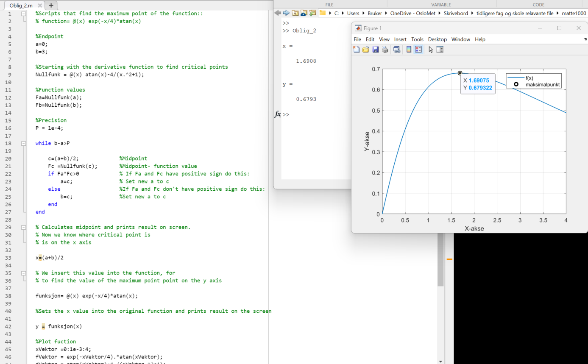

# Analytical and numerical calculation of function

## Subject: Mathematics 1000

The task is to show analytical and numerical calculation of the maximum point of a given function: $f(x) = e^{-x/4}\cdot \arctan(x)$

I am also asked to show that the maximum point can also be displayed with the following function: $\arctan(x) - \frac{4}{x^2 + 1} = 0$ and prove that this two
different functions are equivalent.
 
 <b>Numerical part:</b>

The scripts that find the maximum point of the function:
 $function= @(x) e^{-x/4}\cdot \arctan(x)$
 
 I have derived function by hand and called it Nullfunk in my script furthermore, I use the Bisection method to find my critical point with Nullfunk in interval $[0,3]$
 
 <b>algorithm goes as followes:</b>
 
 1. Start with two values, a and b, such that the function f(x) has opposite signs at a and b (f(a) and f(b) have opposite signs). This means that a root of the function must lie between a and b.
 2. Calculate the midpoint of the interval, c = (a + b)/2.
 3. If f(c) is equal to zero, then c is a root of the function and the algorithm terminates.
 4. If f(a) and f(c) have opposite signs, then the root must lie in the interval (a, c). Set b = c and go back to step 2.
 5. If f(c) and f(b) have opposite signs, then the root must lie in the interval (c, b). Set a = c and go back to step 2.
 6. Repeat this process until the desired accuracy is achieved.
  
 <b>Numeric solution example:</b>
  
  
  
  
 <b>Analytical calculation of the function:</b>
 

